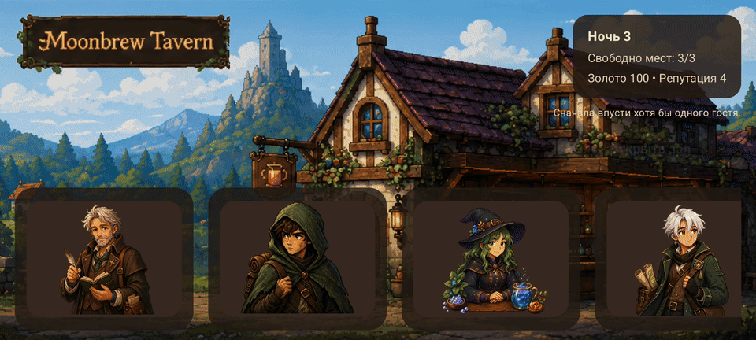
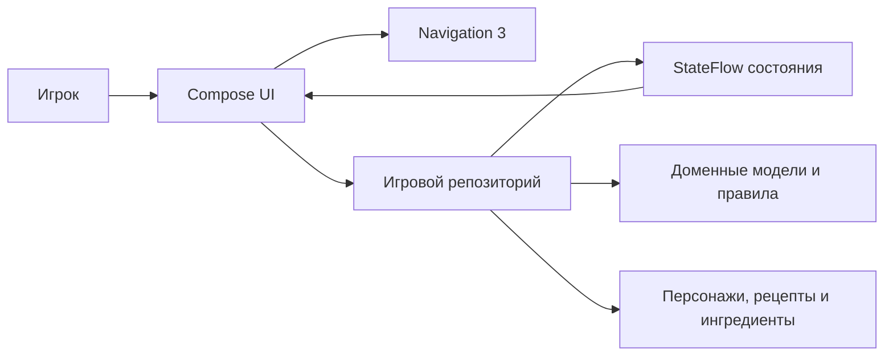

# Moonbrew Tavern

## Демо-видео



**Moonbrew Tavern** — атмосферная мобильная игра для Android в жанре уютной сюжетной RPG с элементами управления таверной.

Игрок принимает посетителей, разговаривает с ними, подбирает рецепты и готовит магические напитки. Качество обслуживания влияет на золото, репутацию и отношения с гостями.

Проект выполнен как рабочий игровой прототип с полным циклом одной ночи и возможностью продолжать игру в следующих ночах.

## Игровой процесс

Основной цикл игры:

1. На улице формируется очередь посетителей.
2. Игрок решает, кого впустить в таверну.
3. В зале запускается таймер ночи.
4. Игрок общается с гостями и узнаёт их заказы.
5. В книге рецептов выбирается напиток.
6. Напиток готовится в интерактивной мини-игре.
7. Гость оценивает результат, а игрок получает награду.
8. После завершения ночи показывается итоговый экран, после которого начинается следующая ночь.

В текущей версии также реализованы:

- четыре посетителя с отдельными портретами, репликами и предпочтениями;
- состояния гостей: ожидание, употребление напитка и уход;
- золото, репутация и отношения с персонажами;
- покупка и выбор новых рецептов;
- ограниченный запас ингредиентов;
- магазин пополнения ингредиентов;
- списание использованных компонентов;
- оценка напитка по совпадению с рецептом;
- смена ночей и повторное формирование очереди;
- автоматическое сохранение прогресса между перезапусками приложения;
- атмосферные анимации интерфейса и игровых сцен.

## Функциональные требования

| ID | Требование | Статус |
| --- | --- | --- |
| **FR-01** | Система должна формировать очередь посетителей в начале каждой ночи. | Реализовано |
| **FR-02** | Игрок должен иметь возможность впустить посетителя или отказать ему. | Реализовано |
| **FR-03** | Количество одновременно принятых гостей должно ограничиваться вместимостью таверны. | Реализовано |
| **FR-04** | Система должна отображать принятых посетителей в зале и хранить их текущее состояние. | Реализовано |
| **FR-05** | Посетитель должен переходить между состояниями ожидания заказа, употребления напитка и ухода. | Реализовано |
| **FR-06** | Во время активной ночи должен работать глобальный таймер, который продолжает идти при переходах между игровыми экранами. | Реализовано |
| **FR-07** | Игрок должен иметь возможность начать диалог с ожидающим посетителем и выбрать реплику. | Реализовано |
| **FR-08** | Каждый посетитель должен иметь собственные портрет, описание, заказ и вкусовые предпочтения. | Реализовано |
| **FR-09** | Система должна предоставлять книгу доступных и закрытых рецептов. | Реализовано |
| **FR-10** | Игрок должен иметь возможность покупать новые рецепты за накопленное золото. | Реализовано |
| **FR-11** | Игрок должен иметь возможность выбрать открытый рецепт для приготовления. | Реализовано |
| **FR-12** | Система должна хранить ограниченный запас каждого ингредиента. | Реализовано |
| **FR-13** | Игрок должен иметь возможность покупать ингредиенты, если у него достаточно золота. | Реализовано |
| **FR-14** | Мини-игра варки должна позволять выбирать ингредиенты, перемешивать напиток и задавать его цвет. | Реализовано |
| **FR-15** | Система не должна позволять начать приготовление рецепта при недостатке ингредиентов. | Реализовано |
| **FR-16** | После подачи напитка использованные ингредиенты должны списываться из запасов. | Реализовано |
| **FR-17** | Система должна сравнивать приготовленный напиток с выбранным рецептом и определять качество результата. | Реализовано |
| **FR-18** | После обслуживания должен отображаться результат с реакцией гостя и полученной наградой. | Реализовано |
| **FR-19** | Золото, репутация и отношения с посетителями должны изменяться в зависимости от результата. | Реализовано |
| **FR-20** | После завершения ночи система должна показать итоговый экран, а затем увеличить номер ночи и сформировать новую очередь. | Реализовано |
| **FR-21** | Игрок должен иметь возможность возвращаться с экранов рецептов и варки без потери корректного состояния гостя. | Реализовано |
| **FR-22** | Прогресс должен сохраняться после полного закрытия и повторного запуска приложения. | Реализовано |

### Основные сценарии использования

**Обслуживание гостя:** игрок впускает посетителя, открывает зал, начинает диалог, выбирает рецепт, готовит напиток и получает результат.

**Покупка рецепта:** игрок накапливает золото, открывает книгу рецептов, выбирает закрытый рецепт и покупает его при достаточном балансе.

**Пополнение запасов:** игрок открывает лавку ингредиентов, покупает необходимые компоненты и после обновления запасов начинает приготовление.

**Завершение ночи:** игрок обслуживает или отклоняет всех посетителей, после чего система увеличивает номер ночи и создаёт новую очередь.
Перед началом следующей ночи игрок видит краткий итоговый экран с результатами.

## Используемые технологии

| Технология | Назначение |
| --- | --- |
| **Kotlin 2.3** | Основной язык разработки |
| **Jetpack Compose** | Декларативное построение игрового интерфейса |
| **Material 3** | Базовые UI-компоненты и система тем |
| **AndroidX Navigation 3** | Переходы между игровыми экранами |
| **StateFlow** | Реактивное хранение и передача состояния |
| **Kotlin Coroutines** | Таймер ночи и асинхронная игровая логика |
| **Android Lifecycle** | Связь состояния приложения с Compose |
| **Jetpack DataStore** | Локальное типобезопасное сохранение игрового прогресса |
| **Gradle** | Сборка проекта и управление зависимостями |
| **JUnit 4** | Модульное тестирование игровой логики |
| **Android Studio** | Основная среда разработки |

Технические параметры Android-приложения:

- минимальная версия: Android 7.0 / API 24;
- целевая и компилируемая версия: API 36;
- версия Java: 17;
- ориентация приложения: альбомная.

## Верхнеуровневая архитектура

Архитектура разделяет отображение, игровое состояние, правила и контент.



### UI-слой

Jetpack Compose отвечает за отображение игровых сцен и обработку действий пользователя. Каждый этап игрового цикла представлен отдельным экраном: очередь, зал, диалог, книга рецептов, варка и результат.
Также реализован отдельный экран завершения ночи.

UI получает готовое состояние и отправляет пользовательские действия в игровой репозиторий. Расчёт наград, списание ингредиентов и смена ночей не выполняются непосредственно в интерфейсе.

### Игровая логика и состояние

Центральным источником истины является репозиторий игрового состояния. Он управляет:

- текущей фазой игры;
- очередью и состояниями гостей;
- таймером ночи;
- выбранным рецептом;
- запасами и покупками;
- результатами приготовления;
- наградами и переходом между ночами.

Состояние публикуется через `StateFlow`. При его изменении Compose автоматически обновляет соответствующие элементы интерфейса.

### Доменный слой

Доменные модели описывают основные сущности игры:

- состояние игры и ночи;
- посетителей;
- рецепты и ингредиенты;
- состояние гостя в таверне;
- результат приготовленного напитка;
- награды и отношения.

Этот слой не зависит от конкретного визуального представления экранов.

### Контент

Персонажи, рецепты и ингредиенты описаны отдельно от основной логики. Такое разделение позволяет добавлять новое игровое содержимое без переработки всего игрового цикла.

### Навигация

Навигация связывает экраны в последовательный игровой процесс:

```text
Очередь → Зал → Диалог → Книга рецептов → Варка → Зал → Результат → Итог ночи
```

Таймер ночи является частью глобального состояния текущей ночи и продолжает идти при переходах между игровыми экранами, пока ночь не завершена.

## Хранение прогресса

Прогресс теперь сохраняется локально на устройстве автоматически после игровых изменений. Для этого используется typed `DataStore` с единым snapshot-объектом игрового состояния.

После перезапуска приложения восстанавливаются:

- номер ночи;
- золото и репутация;
- открытые рецепты;
- запасы ингредиентов;
- отношения с посетителями;
- состояние текущей очереди и гостей.
- выбранный активный рецепт;
- последний результат приготовления;
- текущая фаза игрового цикла и состояние ночного таймера.

Для текущего прототипа это наиболее уместный вариант: проекту не нужна полноценная база данных, потому что здесь хранится один компактный игровой слепок, а не набор связанных таблиц и запросов. `DataStore` подходит лучше `SharedPreferences`, потому что остаётся современным, типобезопасным и удобным для эволюции модели. Если позже появятся несколько слотов сохранения, сложные выборки или крупная реляционная модель, слой хранения можно будет вынести в Room.

## Сборка и запуск

Проект Android находится в каталоге `android-app`.

Для запуска:

1. Открыть `android-app` в Android Studio.
2. Дождаться синхронизации Gradle.
3. Запустить модуль `app` на эмуляторе или Android-устройстве.

Сборка debug APK:

```bash
cd android-app
./gradlew assembleDebug
```

Запуск модульных тестов:

```bash
cd android-app
./gradlew testDebugUnitTest
```

## Примечание о контенте

Визуальный контент был сгенерирован с помощью ChatGPT 5.5, а затем вручную обработан, доработан и адаптирован для проекта.

## Документация

- [Описание игры](docs/game-design.md)
- [Архитектура](docs/architecture.md)
- [Требования](docs/requirements.md)
- [Инструментарий](docs/tooling.md)
- [Процесс разработки](docs/development-process.md)
- [План развития](docs/planning/roadmap.md)
- [План тестирования](docs/test-plan.md)
- [Правила участия](CONTRIBUTING.md)
