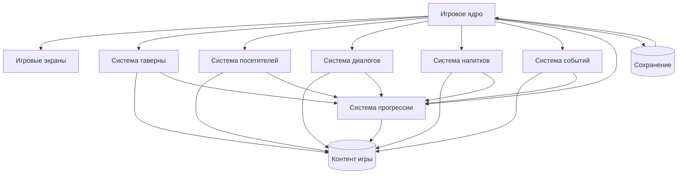
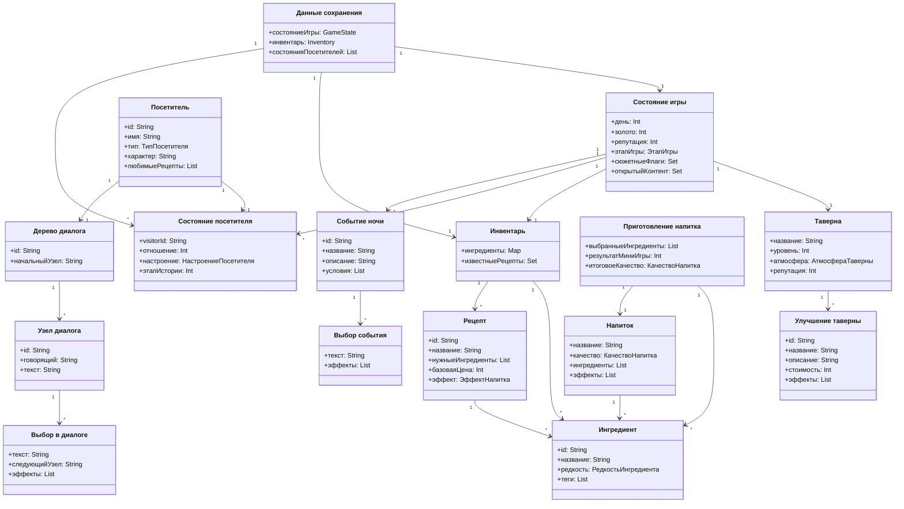

# Архитектура

Архитектура Moonbrew Tavern описывает не техническую обвязку Android, а устройство самой игры: какие крупные части в ней есть и как они связаны между собой.

Главная цель архитектуры — сделать проект расширяемым. В игру должно быть удобно добавлять новых посетителей, рецепты, события, улучшения таверны и сюжетные линии.

## Принципы

- Игровая логика отделяется от отображения.
- Контент хранится отдельно от правил игры.
- Сохранение прогресса работает с общим состоянием игры.
- Каждая крупная механика оформляется как отдельная система.
- Android Canvas / Skia и Box2D рассматриваются как инструменты реализации, а не как игровые сущности.

## Основные части проекта

| Часть | Назначение |
| --- | --- |
| Игровое ядро | Управляет текущим состоянием игры и переходами между этапами. |
| Игровые экраны | Показывают таверну, диалоги, приготовление напитков и результаты ночи. |
| Система таверны | Отвечает за уровень таверны, улучшения, репутацию и атмосферу. |
| Система посетителей | Хранит посетителей, их настроение, отношения и личный прогресс. |
| Система диалогов | Управляет репликами, выборами игрока и последствиями ответов. |
| Система напитков | Работает с ингредиентами, рецептами, качеством напитка и мини-игрой. |
| Система событий | Запускает случайные и сюжетные события. |
| Система прогрессии | Открывает новый контент: рецепты, посетителей, события, улучшения. |
| Контент игры | Описания NPC, рецептов, ингредиентов, событий и улучшений. |
| Сохранение | Хранит прогресс игрока между запусками игры. |

## Диаграмма компонентов

## Диаграмма классов

Диаграмма классов показывает основные сущности игры и оставляет место для расширения. Например, позже можно добавить классы для достижений, квестов, комнат таверны, редких ингредиентов или отдельных сюжетных линий.
